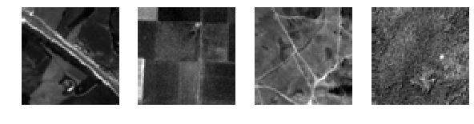
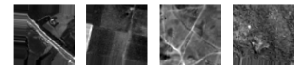
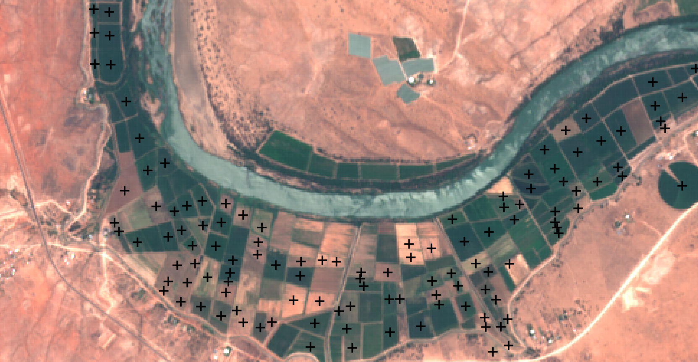

# Hyperspectral Image Generator

This is a tool that creates an image generator for Keras that is useful for hyperspectral images. It implements data augmentation. This tool is developed originally from [CNN Sentinel](https://github.com/jensleitloff/CNN-Sentinel) repository and uses main functions as is from the original repository.

## Features
It allows an image generator to make the following transformations on images:
- Horizontal/Vertical flip
- Rotation
- Shear
- Translation
- Zooming
- Addition of speckle noise

UPDATE: It now supports cropping from larger tiles.

It uses the edge pixels to pad the pixels that become missing due to the transformations.

**Without augmentation:**

**With augmentation:**

## Requirements
These are the requirements for running this whole simulation. The generator itself only uses scikit-image and numpy libraries.
- Keras
- Tensorflow
- Numpy
- Pandas
- Scikit-image

For tile cropping:
- Geopandas
- Rasterio
- Fiona
- Shapely

## How to use (basic mode)
The tool itself is located in hyperspectral_image_generator.py. It depends on some preprocessing functions that loads image mean and std and the files.

A use case is imported from the [original repository](https://github.com/jensleitloff/CNN-Sentinel) for CNN-Sentinel classification. You should refer to the documentation there for more details on how to obtain the data.

First, download the [data](http://madm.dfki.de/downloads) and write the data path into split_data_to_train_and_validation.py then run it to generate training and test datasets.

Then run train_hyperspectral_vgg19.py to train a VGG19 network using image augmentation. You can test the function to visualize the output using image_augmentation_demo notebook.

## How to use tile cropping

I used data from the farm pin crop detection challenge from the [Zindi][https://zindi.africa/competitions/farm-pin-crop-detection-challenge]
A demo of the generator is included at the end of the notebook. Note that you need to download the data from the website 
and concatenate each two tiles belonging to the same time frame together (Data is quite large). The shape file with labels 
and centroids is included in the repo but it is just a processed version of the original file, I do not possess any rights 
to the data it comprises.

## Future plans
- Allow different modes of noise other than speckle noise.
